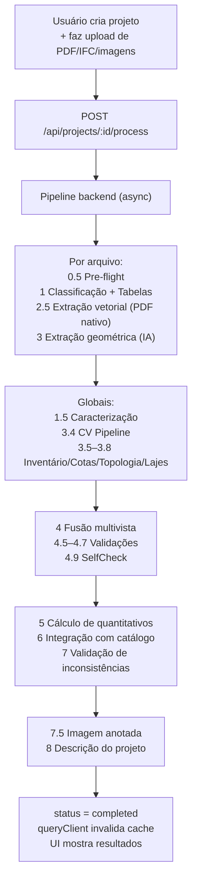
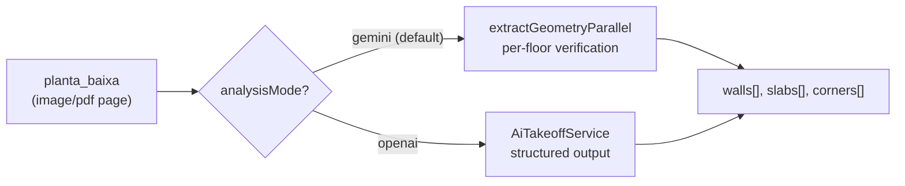
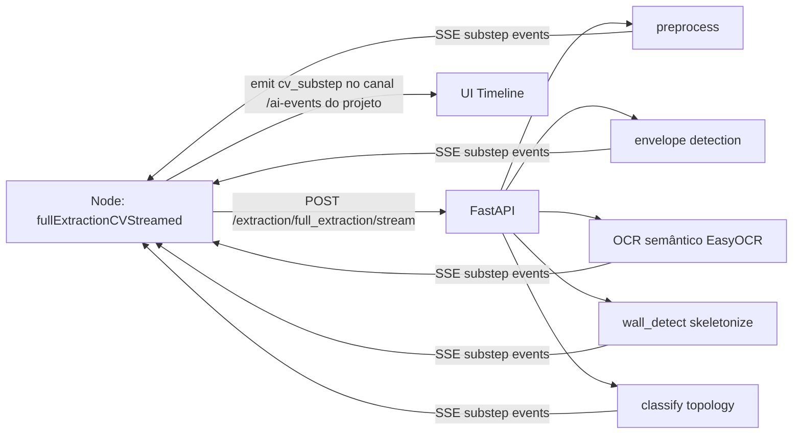
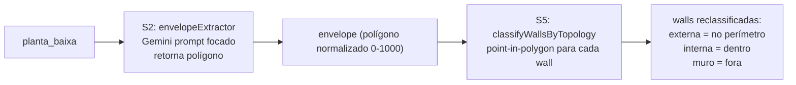
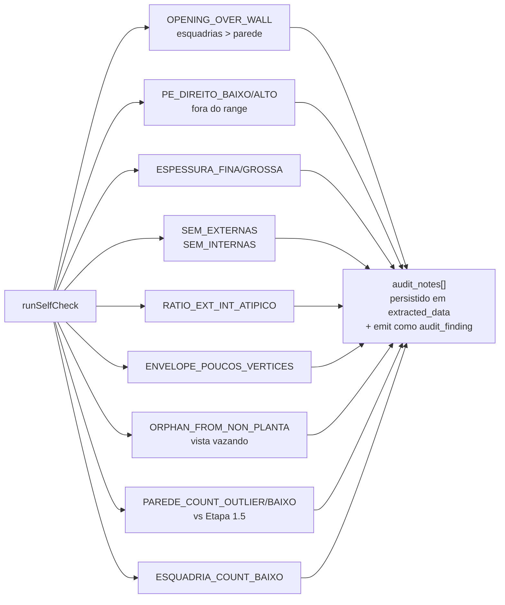
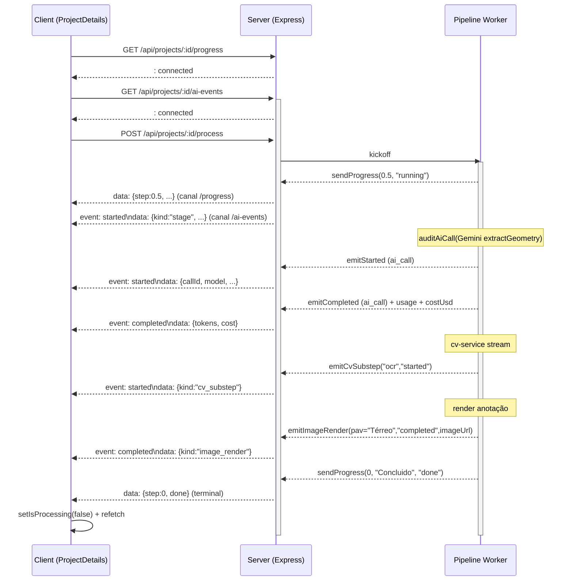
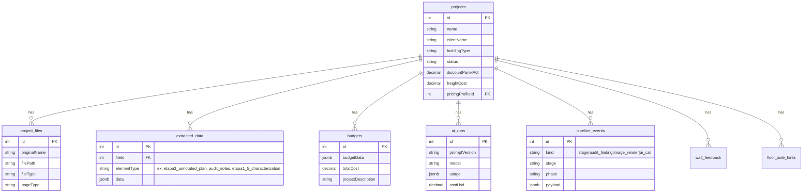
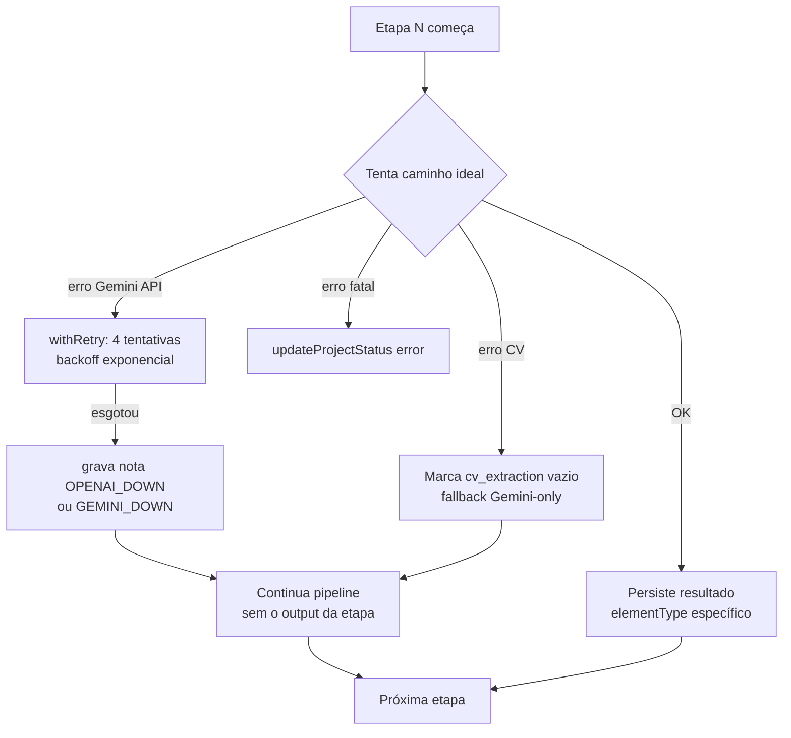

# Pipeline de Análise — Lightwall Orçamento

> Documento técnico detalhado do algoritmo passo a passo. Reflete o código em `main` no momento da escrita; pequenas reordenações podem ocorrer entre releases — quando em dúvida, `server/routes.ts` é a fonte da verdade.

> ⚠️ **Status atual (2026-05-31): Pipeline enxuto**
>
> 5 etapas foram **removidas** (comentadas no código) por não trazerem retorno mensurável:
>
> | # | Etapa | Motivo da remoção |
> |---|---|---|
> | 2.5 | Vetor PDF Nativo | Escala "não confiável" descarta paredes em ~80% dos PDFs. Etapa 3 Gemini cobre. |
> | 3.4 | CV Pipeline | cv-service offline em ~100% dos deploys atuais. Consome 5-30s sem retorno. |
> | 3.6 | Cotas focadas | Match rate ~0%. Etapa 3 já lê cotas no mesmo prompt. -US$ 0,03 e -40-60s. |
> | 4.6 | Validação Global IA | Redundante com Etapas 3 e 4.9. Era opt-in (não rodava por default). |
> | 4.65 | Reconciliação CV-LLM | Consequência de 3.4: sem CV não há o que reconciliar. |
>
> Pipeline ativo: **12 etapas obrigatórias** + 1 condicional (4.7 só se há cortes) + 1 condicional (1-IFC só se .ifc, mas upload de IFC foi removido da UI).
>
> Como reativar uma etapa: descomentar o bloco correspondente em `server/routes.ts` (comentado como `[REMOVED 2026-05-31] motivo: ...`). Imports estão preservados.

---

## 1. Visão geral

O sistema é composto por **três processos** que cooperam:

```mermaid
flowchart LR
    subgraph Client["Client (React + Vite)"]
        UI["ProjectDetails.tsx<br/>upload, scope, kickoff,<br/>SSE consumer"]
    end

    subgraph Server["Server (Node + Express)"]
        ROUTES["routes.ts<br/>orquestrador do pipeline"]
        SVC["services/*<br/>gemini, extraction,<br/>annotation, calculation"]
        DB[("PostgreSQL<br/>via Drizzle ORM")]
    end

    subgraph CV["cv-service (Python + FastAPI)"]
        FAST["/extraction/<br/>full_extraction +<br/>full_extraction/stream"]
        OPENCV["OpenCV, Shapely,<br/>scikit-image, EasyOCR"]
    end

    UI -- "POST /api/projects/:id/process" --> ROUTES
    UI <-. "SSE /progress + /ai-events" .- ROUTES
    ROUTES --> SVC
    SVC --> DB
    SVC -- "POST /extraction/*" --> FAST
    FAST --> OPENCV
    SVC -. "fallback Gemini-only<br/>se cv-service offline" .-> SVC
```

- **Client** (`client/src/`): dispara `POST /api/projects/:id/process`, escuta dois canais SSE (`/progress` para o stepper, `/ai-events` para a timeline detalhada com tokens/custo).
- **Server** (`server/`): orquestra todas as etapas, chama LLMs (Gemini 2.5 Pro, OpenAI gpt-5-mini/4o), persiste em `extracted_data`, `budgets`, `audit_notes`, `pipeline_events`.
- **cv-service** (`cv-service/`): microsserviço Python opcional para visão computacional pura (sem IA). Se offline, o pipeline degrada graciosamente para Gemini-only.

---

## 2. Fluxo de ponta a ponta



Eventos SSE são emitidos continuamente do passo (D) até (I). O timer do client é local — não depende de eventos para contar tempo.

---

## 3. Tabela compacta das etapas

| Nº | Nome | Onde roda | Output principal | Falha → |
|----|------|-----------|------------------|---------|
| 0.5 | Pre-flight | per arquivo | tipo, vetorial vs raster, recomendação de modo | continua silencioso |
| 1 | Classificação + Tabelas | per arquivo (Gemini ou OpenAI) | `classifications[]`, `tableData` | etapa 3 ainda tenta |
| 1 | Leitura IFC | per arquivo (.ifc) | `wallCount`, `slabCount`, `doorCount` | etapa 3 não roda |
| 2.5 | Extração vetorial nativa | per arquivo PDF | walls/slabs/corners de bordas vetoriais | OpenAI/Gemini ainda roda |
| 3 | Extração geométrica | per arquivo | `walls[]`, `slabs[]`, `corners[]` | erro → registra `failedPages` |
| 1.5 | Caracterização | global | `etapa1_5_characterization` (JSON tipado) | usa `buildingType` hardcoded |
| 3.4 | CV Pipeline (Fase E) | global | `cv_extraction` para reconciliação | fallback Gemini-only |
| 3.5 | Inventário (endpoints) | global | walls enriquecidas com `p1, p2` | walls ficam só com `bbox` |
| 3.6 | Cotas (focado) | global | comprimentos de paredes em metros | comprimento herdado da etapa 3 |
| 3.7 | Topologia | global | `envelopes[]`, walls reclassificadas | mantém classificação IA original |
| 3.8 | Lajes (polygon) | global | área de lajes refinada via shoelace | lajes com `area_m2` original |
| 4 | Fusão multivista | global | `fused.walls/slabs/corners` deduplicado | erro fatal — pipeline para |
| 4.5 | Validação geométrica | global | descarta walls com áreas absurdas | (sempre roda) |
| 4.55 | Esquadrias (linker) | global | esquadrias cruzadas com quadro | sem cruzamento |
| 4.6 | Validação global IA | global | correções cruzadas via Gemini | continua sem correção |
| 4.65 | Reconciliação CV-LLM | global | A/B paredes CV vs LLM | continua só com LLM |
| 4.7 | Validação por cortes | global | alturas reconciliadas com cortes | pé-direito default |
| 4.9 | SelfCheck | global | `audit_notes[]` | sem notas |
| 5 | Cálculo de quantitativos | global | `budget.pavimentos`, `consolidado` | erro fatal |
| 6 | Integração com catálogo | global | preços aplicados + frete + descontos | usa preços padrão |
| 7 | Validação | global | `inconsistencias[]` no budget | (sempre roda) |
| 7.5 | Imagem anotada | global (em paralelo com 8) | PNGs com overlay + referenceImages | `annotationErrors[]` |
| 8 | Descrição do projeto | global (em paralelo com 7.5) | `budget.projectDescription` (markdown) | mensagem padrão |

---

## 4. Detalhe de cada etapa

### 4.1 Etapa 0.5 — Pre-flight

**Arquivo**: `server/services/preflight/inspector.ts`
**Por arquivo**.

Inspeção rápida sem chamar IA:
- Detecta tipo real (PDF vetorial vs raster vs imagem vs IFC).
- Conta páginas do PDF, verifica se tem texto extraível, estima DPI.
- Recomenda modo (`extractFromVectorPdf` se vetorial, IA se raster, parser BIM se IFC).

**Por que existe**: previne mandar um PDF de 50 MB de scanner pra Gemini sem pré-tratamento. Faz cache em `_splitCache` (Map global em `planAnalyzer.ts`) para reutilizar a divisão de páginas nas etapas seguintes.

### 4.2 Etapa 1 — Classificação + Tabelas (Gemini/OpenAI) ou Leitura IFC

**Arquivos**: `server/services/gemini/planAnalyzer.ts` (`classifyAndExtractTables`), `server/services/ifc/ifcAnalyzer.ts`.
**Por arquivo**.

Para IFC: parser direto, sem IA, gera walls/slabs já estruturados.

Para PDF/imagem (chamada unificada para reduzir round-trips):
- Roda uma chamada Gemini multi-page com prompt único que retorna JSON:
  ```json
  {
    "classifications": [{"page_index":0,"classificacao":"planta_baixa","pavimento":"Térreo","has_table":false,"has_scale":true}],
    "tableData": {"paredes_de_tabela":[], "esquadrias_de_tabela":[], "areas_de_tabela":[]},
    "detectedBuildingType": "residencial"
  }
  ```
- Páginas são paralelizadas (`maxPages` controla quantas por chamada).
- `buildingType` aqui é apenas dica inicial — refinado depois na Etapa 1.5.

### 4.3 Etapa 1.5 — Caracterização (PR1)

**Arquivo**: `server/services/extraction/projectCharacterization.ts`
**Global** (depois do for principal, antes das etapas 3.4+).

Uma chamada Gemini focada em retornar **JSON estruturado** (não prosa):

```json
{
  "typology": "casa_terrea",
  "pavimentos": ["Térreo"],
  "programa": [{"ambiente":"quarto","qty":2}, {"ambiente":"sala","qty":1}],
  "padrao": "medio",
  "estimativas": {
    "paredeCountRange": [12, 20],
    "esquadriaCountRange": [8, 14],
    "espessuraParedeM": [0.10, 0.15],
    "peDireitoM": [2.60, 2.90],
    "areaTotalRangeM2": [80, 140]
  },
  "caracteristicas": {
    "temCobertura": true, "temGaragem": false, "temMuros": true,
    "temPergolado": false, "formaEnvelopePrincipal": "retangular_simples"
  },
  "confidence": "high",
  "notes": "..."
}
```

Esse JSON alimenta:
- `envelopeExtractor` (hint de forma no prompt)
- `selfCheck` (ranges dinâmicos de pé-direito, espessura, count)
- `describeProject` (input rico, evita re-descoberta)

Fail-soft: se Gemini erra ou retorna JSON inválido, cai pra defaults hardcoded em `buildingTypePrompts.ts`.

### 4.4 Etapa 2.5 — Extração vetorial nativa

**Arquivo**: `server/services/preflight/pdfVectorExtractor.ts`
**Por arquivo PDF**.

Lê edges/bbox direto do PDF (sem rasterizar), usando pdf-lib. Bom em projetos exportados de CAD com geometria preservada. Os walls/slabs derivados disso são guardados separados — depois competem com os da etapa 3 na fusão.

### 4.5 Etapa 3 — Extração geométrica (IA)

**Arquivo**: `server/services/gemini/planAnalyzer.ts` (`extractGeometryParallel`) ou `server/services/takeoff/aiTakeoffService.ts` (OpenAI Vision).
**Por arquivo**.

Dois caminhos:

**Caminho A — Gemini-only ou Gemini multi-modelo (padrão)**:
- Chamada `extractGeometryParallel(filePath, fileType, classifications, MAX_PAGES, buildingType, peDireito)`.
- Cada planta_baixa vira uma chamada Gemini-2.5-flash com prompt monolítico extraindo walls, slabs, corners, esquadrias.
- Per-floor verification integrada (cross-model verification opcional com OpenAI).

**Caminho B — OpenAI Vision Takeoff (`analysisMode=openai`)**:
- Para cada planta_baixa, chamada estruturada `AiTakeoffService.analyzeSheetImage` retorna `segments[]` tipados.
- Geometria convertida no formato do pipeline.



### 4.6 Etapa 3.4 — CV Pipeline (Fase E, cv-service)

**Arquivos**: `server/services/cv-service/client.ts`, `cv-service/app/routers/extraction.py`
**Global, opcional**.



Quando `cv-service` está saudável e em modo real (não stub), roda:
1. **Preprocess**: binarização, limpeza de ruído, normalização.
2. **Envelope detection**: alphashape multi-scale + watershed para contorno externo.
3. **OCR semântico**: EasyOCR + dicionário de tipologias brasileiras (`quarto`, `bwc`, `cozinha`...).
4. **Wall detection**: skeletonize + Harris corners + fitLine para extrair segmentos.
5. **Classify topology**: Shapely buffer/intersect para classificar walls em externa/interna/muro determinísticamente.

Cada sub-passo emite evento `cv_substep` (preprocess → ocr → wall_detect → classify) na timeline ao-vivo.

**Stream timeout**: 90s (PR2 + correção). Se passar disso, aborta e cai em Gemini-only.

**Fallback automático**: se endpoint `/full_extraction/stream` retorna 404 (cv-service antigo), o cliente Node usa `/full_extraction` síncrono.

### 4.7 Etapa 3.5 — Inventário de paredes com endpoints

**Arquivo**: `server/services/extraction/wallInventory.ts`
**Global** (S4 da metodologia passo-a-passo).

Para cada planta_baixa, prompt **focado** que pede só uma coisa: listar paredes como segmentos `(p1, p2, thickness_pct, has_door, has_window)`. Sem classificar externa/interna — isso é tarefa da Topologia (3.7).

`mergeEndpointsIntoWalls()` casa segmentos com walls existentes da Etapa 3 via IoU/distância e enriquece com endpoints. Resultado: renderer pode desenhar **linha sobre o eixo da parede** em vez de retângulo aproximado.

### 4.8 Etapa 3.6 — Cotas focadas

**Arquivo**: `server/services/extraction/cotaReader.ts`
**Global** (S7 da metodologia).

Prompt focado: lista todas as cotas dimensionais (texto numérico + posição) das plantas. Depois `mergeCotasIntoWalls()` cruza cada cota com a parede de direção/posição compatível, sobrescrevendo `comprimento_m` com `measurement_source="cota_text_focused"`.

Resultado: comprimentos passam de "estimativa visual da IA" para "leitura literal da cota anotada".

### 4.9 Etapa 3.7 — Topologia (envelope + classificação)

**Arquivos**: `server/services/extraction/envelopeExtractor.ts`, `server/services/extraction/topology.ts`
**Global** (S2 + S5 da metodologia / Fase A).



Princípio: **separa raciocínio do LLM (forma) de raciocínio determinístico (classificação)**. LLM é bom em ver formas, mas confunde externa/interna em planta cheia. Code determinístico não confunde — basta um point-in-polygon contra o envelope.

Caracterização (Etapa 1.5) injeta hint `formaEnvelopePrincipal` no prompt do envelope: "retangular_simples" → modelo privilegia 4 vértices ortogonais.

### 4.10 Etapa 3.8 — Lajes (polygon)

**Arquivo**: `server/services/extraction/slabRefiner.ts`
**Global**.

Para CASA-PADRÃO (1 piso por pavimento), o envelope já vira o polígono da laje piso — sem chamada IA. Recalcula área via shoelace (`polygonAreaNorm` em `geometryUtils.ts`) e marca `measurement_source="polygon_focused"`.

Plantas com várias lajes disjuntas (raras) fazem chamada Gemini extra focada nos polígonos das lajes.

### 4.11 Etapa 4 — Fusão multivista

**Arquivo**: `server/services/extraction/fusion.ts` (lógica embarcada em `routes.ts`)
**Global**.

Cruza dados de TODOS os arquivos / TODAS as páginas:
- Deduplicação por proximidade (paredes de plantas diferentes no mesmo pavimento, esquadrias do quadro vs detectadas na planta).
- Procedência (`sourceContribution`): cada wall/slab carrega `primary.view` (sempre planta_baixa/planta_cobertura) + `enrichments[]` de outras vistas (corte, fachada).
- Filtro de espessura: walls com espessura > limite configurável (default 12cm) são marcadas como mobiliário e removidas.

Após fusão, aplica o `scope` do projeto (paredes externas/internas/muros/laje piso/coberta/cantos — usuário escolhe quais entram no orçamento).

### 4.12 Etapas 4.5–4.7 — Validações

| Etapa | O que faz |
|---|---|
| 4.5 Validação Geométrica | `validateGeometry` descarta walls com área zero, comprimentos negativos, polígonos degenerados. |
| 4.55 Esquadrias (linker) | `linkEsquadriasWithTable` cruza esquadrias detectadas com `esquadrias_de_tabela` (quadro de esquadrias). |
| 4.6 Validação Global IA | `runGlobalCrossValidation` — chamada Gemini cruzando TODAS as plantas pra detectar inconsistências (parede no andar 1 não existe no corte, etc). |
| 4.65 Reconciliação CV-LLM | Quando `cv_extraction` existe, A/B compara walls do CV vs walls do LLM e gera audit_notes. |
| 4.7 Validação por Cortes | Extrai alturas dos cortes/fachadas e reconcilia com `altura_m` das walls. |

### 4.13 Etapa 4.9 — SelfCheck

**Arquivo**: `server/services/extraction/selfCheck.ts`
**Global** (S12 da metodologia / Fase D).

Validações determinísticas em código puro:



Os ranges (pé-direito, espessura, contagem) são **dinâmicos**: vêm da caracterização (Etapa 1.5) com margem de ±20–30% pra evitar falsos positivos. Sem caracterização, cai em ranges hardcoded por `buildingType`.

### 4.14 Etapa 5 — Cálculo de quantitativos

**Arquivo**: `server/services/calculation/budgetCalculator.ts`
**Global**.

Aplica regras do Manual Biomassa:
- **Painéis**: cada parede divide-se em múltiplos de painel padrão (60–200mm dependendo do produto). Sobras viram painéis menores ou descartes.
- **Cantoneiras**: cantos identificados na etapa 3 + topologia geram conectores L/T.
- **Esquadrias**: aberturas reduzem a área útil de parede; vão pra orçamento separado de moldura.
- **Lajes**: piso/coberta entram em produtos próprios.

Saída: `budget.pavimentos[]` com paineis por categoria, `consolidado_por_tipo`, `resumo.total_geral_paineis`.

### 4.15 Etapa 6 — Integração com catálogo

**Global**.

Aplica preços do projeto (`pricingProfileId` se houver, senão preço padrão), frete (`freightCost`), biomassa (`biomassCost`), desconto de painéis (`discountPanelPct`).

### 4.16 Etapa 7 — Validação de inconsistências

Roda regras de sanidade pós-orçamento (orçamento zerado, áreas negativas, percentuais > 100%) e gera `budget.inconsistencias[]` por severidade.

### 4.17 Etapa 7.5 — Imagem anotada

**Arquivo**: `server/services/annotation/renderer.ts`
**Global**, em paralelo com etapa 8.

Renderização **determinística** no servidor (sharp + SVG composite). Substitui um IA editor de imagem usado anteriormente, que gerava labels inconsistentes.

Para cada pavimento com paredes/lajes:
1. Decodifica imagem-base (PDF → PNG via `pdf-to-png-converter`, ou imagem nativa).
2. Aplica overlay SVG com retângulos/linhas coloridos por classe (externa vermelha, interna verde, muro azul).
3. Adiciona labels W001..Wn com background branco.
4. Sobrepõe envelope (linha cinza) e lot polygon se detectados.

`Promise.all` paralelo por pavimento; **emite `image_render` per pavimento** (started → completed com `imageUrl` ou failed com `errorMessage`). UI pode mostrar grid de thumbnails que aparecem ao vivo.

Falhas viram `annotationErrors[]` persistidas em `etapa3_annotated_plan` para o usuário ver na UI.

### 4.18 Etapa 8 — Descrição do projeto

**Arquivo**: `server/services/gemini/planAnalyzer.ts` (`describeProject`)
**Global**, em paralelo com etapa 7.5.

Chamada Gemini que recebe:
- Imagens dos arquivos
- Classificações
- Sumário geométrico (paredes, lajes, cantos, pavimentos)
- Sumário do orçamento
- **`characterization` da Etapa 1.5** (PR1) — usa como base, não re-descobre.

Gera markdown estruturado:

```
## Identificacao do Projeto
- ...

## Quantitativos Identificados
- ...

## Distribuicao por Pavimento
- ...

## Observacoes para Orcamento
- ...

## Alertas e Ressalvas
- ...
```

---

## 5. Canais de eventos (SSE)

Dois canais SSE servem a UI em tempo real:



**`/api/projects/:id/progress`** (`server/routes.ts:1117`):
- Canal legado consumido pelo stepper. Cada `sendProgress(step, label, status, detail)` emite uma linha.
- Heartbeat a cada 15s mantém a conexão viva em proxies.

**`/api/projects/:id/ai-events`** (`server/routes.ts:1167`):
- Canal unificado. Carrega eventos discriminados por `kind`:
  - `ai_call` (default): chamadas Gemini/OpenAI com tokens + custo.
  - `stage`: espelha cada `sendProgress` para timeline detalhada.
  - `pdf_split`: conversão de PDF página a página.
  - `image_render`: anotação por pavimento, com `imageUrl` quando completed.
  - `cv_substep`: sub-passos do cv-service.
  - `audit_finding`: notas do SelfCheck.
- Heartbeat a cada 15s.
- Eventos importantes são persistidos em `pipeline_events` para reconstrução da timeline em refresh.

**Resiliência (PR2 + fixes recentes)**:
- Server: `withStageHeartbeat(20s)` envolve etapas longas (3.4, 7.5) — emite `running` periódico mesmo enquanto await trava.
- Client: timer local rodando enquanto pipeline não terminou (não depende de SSE estar conectado).
- Cliente reconecta com backoff exponencial 5x; ao esgotar, mostra toast persistente "Reconectar agora" em vez de matar o estado.

---

## 6. Persistência



**`extracted_data.elementType`** carrega o estado intermediário do pipeline. Valores reais:

| elementType | O que guarda | Quando gera |
|---|---|---|
| `parede`, `laje`, `canto` | itens individuais por arquivo | Etapa 3 |
| `parede_tabela`, `esquadria_tabela`, `area_tabela` | itens vindos do quadro de esquadrias/tabelas | Etapa 1 |
| `etapa1_5_characterization` | JSON tipado da caracterização | Etapa 1.5 |
| `etapa3_annotated_plan` | imagens anotadas + referenceImages + annotationErrors | Etapa 7.5 |
| `etapa4_fusao` | resultado da fusão multivista | Etapa 4 |
| `cv_extraction` | resultado do CV pipeline | Etapa 3.4 |
| `audit_notes` | notas do SelfCheck e validadores | Etapa 4.9 |
| `floor_side_hints` | correções humanas de "lado" exterior/interior | UI |
| `wall_feedback` | correções humanas de classificação | UI |

---

## 7. Modos de extração

| Modo | analysisMode | CV-service | Caminho |
|---|---|---|---|
| **Padrão (recomendado)** | `gemini` | online (real) | Etapa 3 Gemini multi-modelo + Etapa 3.4 CV pra reconciliação |
| **Gemini-only** | `gemini` | offline/stub | Etapa 3 Gemini + 3.5/3.6/3.7 Gemini focados + 3.8 determinístico |
| **OpenAI Vision** | `openai` | qualquer | Etapa 3 AiTakeoffService + 3.5/3.6/3.7 inalterados |
| **IFC nativo** | n/a | n/a | Pula 3+; Etapa 1 IFC parser entrega walls já estruturadas |

A escolha vem do payload do POST `/process`. O default usa Gemini, e o cv-service só ativa se `cvServiceCapability()` retorna `{healthy:true, ready:true}` (probing com payload mock antes de cada projeto).

---

## 8. Fallbacks e degradação graciosa



**Etapas que NÃO bloqueiam o pipeline em caso de falha** (graceful):
- 0.5, 1.5, 2.5, 3.4, 3.5, 3.6, 3.7, 3.8, 4.55, 4.6, 4.65, 4.7, 4.9, 7.5, 8

**Etapas que bloqueiam (erro fatal → status `error`)**:
- 1 — sem classificações nem walls extraídas, sem como continuar
- 3 — se TODOS os arquivos falham na extração geométrica
- 4 — fusão é necessária pro orçamento
- 5 — sem cálculo não há orçamento
- 6 — sem catálogo não há custos

---

## 9. Pontos de cuidado

1. **API keys**: env vars (`AI_INTEGRATIONS_GEMINI_API_KEY`, `AI_INTEGRATIONS_OPENAI_API_KEY`) têm prioridade sobre chaves salvas no BD via UI. Em produção, sempre via env (a UI fica read-only por segurança).
2. **Caching de PDF split**: `_splitCache` em `planAnalyzer.ts` é Map global — não invalida entre projetos. Em deploys de longa duração, considerar TTL.
3. **CV stream timeout**: 90s. Se cv-service trava (problemas no Python), `withStageHeartbeat` mantém UI viva e timeout aborta para Gemini-only. Logs em `[CV]` indicam.
4. **Events não persistidos**: `pdf_split` e `cv_substep` são verbosos demais — vivem só em memória. Stage, audit_finding, image_render e ai_call terminal são persistidos em `pipeline_events`.
5. **Re-processamento**: `POST /api/projects/:id/process` apaga `extracted_data` antigo (exceto `floor_side_hints` e `wall_feedback`) antes de começar.
6. **DB migration**: a tabela `pipeline_events` foi adicionada no PR2. Rodar `npm run db:push` em deploys antigos antes do primeiro pipeline.

---

## 10. Como adicionar uma nova etapa

Roteiro mínimo:

1. Crie o módulo em `server/services/extraction/<minhaEtapa>.ts`.
2. Em `server/routes.ts`, insira o bloco da etapa entre etapas existentes:
   ```ts
   try {
     sendProgress(projectId, X.Y, "Minha Etapa", "running", "iniciando...");
     const result = await minhaEtapa({ projectId, ... });
     if (result) {
       await storage.addExtractedData({
         projectId,
         elementType: "etapaX_Y_minha",
         data: result,
         hasAssumption: 0,
       });
     }
     sendProgress(projectId, X.Y, "Minha Etapa", "done", "sumário...");
   } catch (err: any) {
     console.warn(`[MINHA_ETAPA] Pulada por erro: ${err?.message || err}`);
     sendProgress(projectId, X.Y, "Minha Etapa", "done", `pulada (${err?.message || "erro"})`);
   }
   ```
3. Para etapas longas, embrulhe a chamada em `withStageHeartbeat(projectId, X.Y, label, baseDetail, fn)`.
4. Se a etapa precisa chamar Gemini/OpenAI, use `auditAiCall(opts, fn)` para que tokens/custo apareçam na timeline.
5. Atualize o `STEP_CONFIG` em `client/src/pages/ProjectDetails.tsx` se a etapa for mostrada no stepper.
6. Type-check + build.

---

## 11. Referências cruzadas

| Arquivo | Função-chave |
|---|---|
| `server/routes.ts` | Orquestrador principal — `registerRoutes` e bloco `POST /api/projects/:id/process` |
| `server/services/gemini/planAnalyzer.ts` | `classifyAndExtractTables`, `extractGeometryParallel`, `describeProject`, `splitPdfPages`, `getActiveGenAI` |
| `server/services/gemini/buildingTypePrompts.ts` | `BuildingTypeConfig` por tipo + few-shot prompts |
| `server/services/extraction/projectCharacterization.ts` | `characterizeProject` (Etapa 1.5) |
| `server/services/extraction/envelopeExtractor.ts` | `extractEnvelopes` (Etapa 3.7) |
| `server/services/extraction/wallInventory.ts` | `inventoryWalls`, `mergeEndpointsIntoWalls` (Etapa 3.5) |
| `server/services/extraction/cotaReader.ts` | `readCotas`, `mergeCotasIntoWalls` (Etapa 3.6) |
| `server/services/extraction/topology.ts` | `classifyWallsByTopology` (Etapa 3.7 S5) |
| `server/services/extraction/slabRefiner.ts` | `derivePisoSlabsFromEnvelopes`, `mergeSlabPolygons` (Etapa 3.8) |
| `server/services/extraction/selfCheck.ts` | `runSelfCheck` (Etapa 4.9) |
| `server/services/extraction/cvReconciliation.ts` | `reconcileCvWithLlm` (Etapa 4.65) |
| `server/services/extraction/geometryUtils.ts` | `polygonAreaNorm`, `polygonPerimeterNorm` |
| `server/services/audit/aiEvents.ts` | Event bus SSE — emitters tipados, persistência opcional |
| `server/services/audit/aiAuditor.ts` | `auditAiCall` — wrapping de chamadas LLM com persistência + eventos |
| `server/services/cv-service/client.ts` | Cliente HTTP do cv-service — `fullExtractionCV`, `fullExtractionCVStreamed` |
| `cv-service/app/routers/extraction.py` | Endpoints Python — `/full_extraction`, `/full_extraction/stream` |
| `server/services/annotation/renderer.ts` | `renderAnnotatedImage` (Etapa 7.5) |
| `server/services/calculation/budgetCalculator.ts` | `calculateBudget` (Etapa 5) |
| `server/services/calculation/geometryValidator.ts` | `validateGeometry` (Etapa 4.5) |
| `shared/schema.ts` | Drizzle schemas — fonte única de tipos client/server |
| `client/src/pages/ProjectDetails.tsx` | UI principal — SSE consumer, stepper, timer |
| `client/src/components/AiTimeline.tsx` | Timeline detalhada — consome `/ai-events`, filtra por kind |

---

*Última atualização: 2026-05-27. Para mudanças, consulte git log filtrado por `server/routes.ts` e `server/services/`.*
